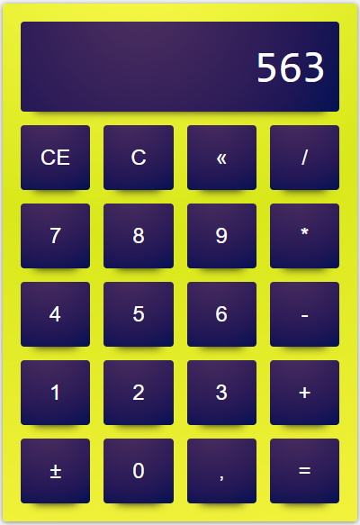

# Calculadora
 

    

 

#
 

 Objetivo do projeto foi aprender e melhorar a parte do javascript como as funções com arrow functions e alguns padrões. 
Você pode navegar tanto com o mouse como no teclado para fazer suas contas.
